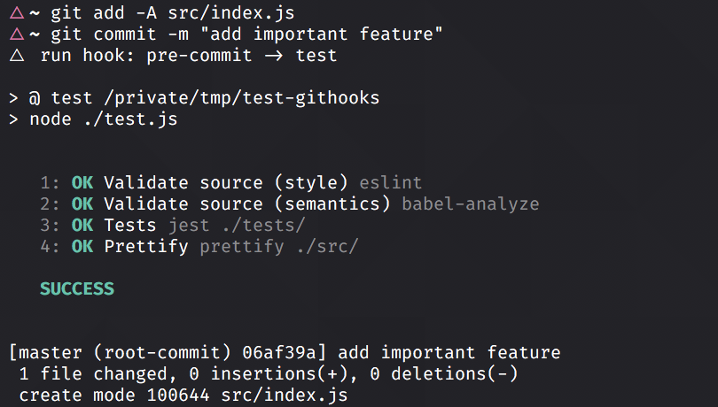

# @zeit/git-hooks

No nonsense [Git hook](https://git-scm.com/docs/githooks) management.



## Usage

Install this module, preferably as a dev-dependency:

```console
yarn add --dev @zeit/git-hooks
```

That's it. You can now use the module in two ways:

```json
{
  "scripts": {
    "git-pre-commit": "eslint"
  }
}
```

The above will run a single command line, just like running `npm run git-pre-commit` or `yarn git-pre-commit`,
every time you `git commit`.

Alternatively, if you'd like to run several scripts in succession upon a hook, you may define a `git` top-level
property and specify an array of scripts to run:

```json
{
  "git": {
    "pre-commit": "lint"
  }
}
```

or

```json
{
  "git": {
    "pre-commit": ["lint", "test"]
  }
}
```

Note that any `"scripts"` hooks supplant any corresponding `"git"` hooks. That is to say, if you define both a
`{"scripts": {"git-pre-commit": "..."}}` hook and a `{"git": {"pre-commit": []}}` hook, the hook in `"scripts"`
will be the only hook that is executed.

## Why? There are hundreds of these.

- No dependencies
- Supports NPM, Yarn, &lt;insert package manager&gt; - this package will detect and use whatever package manager you installed it with&#42;
- Tiny footprint - two script files and a couple of symlinks
- Existing hook / anti-overwrite checks are very reliable since two proprietary scripts are added and all of 'our' hooks are just symlinks
  to those, so there's virtually no way the uninstall script will mistake a pre-existing hook for its own

> &#42;Caveat: The package manager needs to be npm compliant in terms of environment variables.
> Worst case, define the environment variables `npm_node_execpath` (node binary) and `npm_execpath` (package manager entry point)
> as environment variables prior to installing.

# License
Copyright &copy; 2017 by ZEIT, Inc. Released under the [MIT License](LICENSE).
